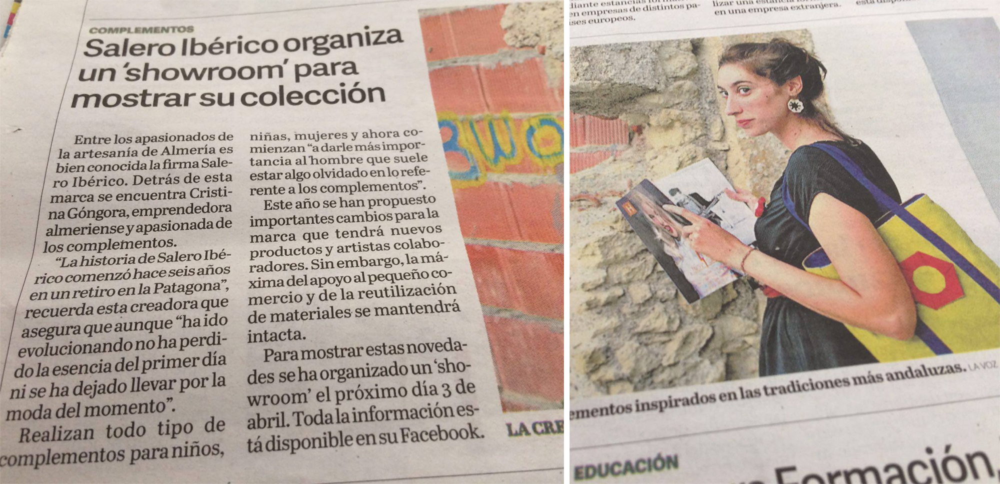
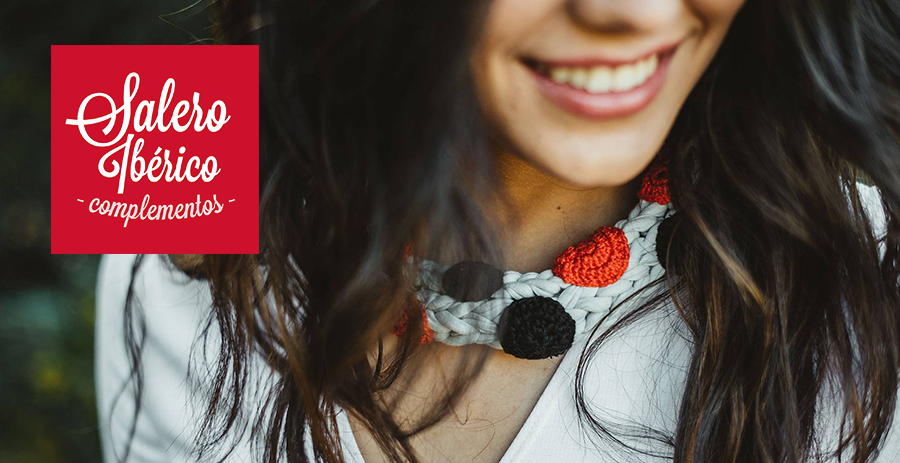

He llegado a formar parte de este grupo por casualidades de la vida. Me encuentro rodeada de tecnología, aunque me queda mucho por aprender. Unirme a este equipo de trabajo me está proporcionando nuevas experiencias, por tal motivo, me encantaría aportar mis conocimientos educativos y creativos al  proyecto.

### Psicopedagogía y educación

Las personas que me rodean me conocen principalmente por ser [maestra y psicopedagoga](http://www.facebook.com/cristina.gongora.psicopedagogia), desde bien pequeña tuve claro que me dedicaría a enseñar, lo puse en práctica en infinidad de ocasiones en mis juegos infantiles, finalmente decidí dedicarme a acompañar y guiar a niños y adolescentes gracias a la disciplina de la psicopedagogía. Llevo ya más de 10 años dedicándome profesionalmente a este mundo tan cambiante y apasionante, no concibo la vida sin enseñar.

{: .natural }

Si necesitas más información sobre apoyo escolar y psicopedagógico, manejo conductual y hábitos de estudio entra en: [www.fb.com/cristina.gongora.psicopedagogia](http://www.facebook.com/cristina.gongora.psicopedagogia) o ponte en contacto conmigo.

### Salero Ibérico y manualidades

Por otra parte, me conocen por mi labor artesanal, tengo una marca de complementos llamada [Salero Ibérico](http://www.facebook.com/saleroiberico) desde hace 7 años, con la que disfruto enormemente ya que me proporciona ratos de creatividad, aprendizaje y sobre todo supone un gran reto tener que reinventarme cada temporada. Ambas actividades me mantienen en una vida social activa que me hacen conectar con grandes personas y profesionales.

Si quieres adquirir algún complemento puedes hacerlo aquí: [www.saleroiberico.com](http://www.saleroiberico.com) // [www.fb.com/saleroiberico](http://www.facebook.com/saleroiberico), o ponerte en contacto conmigo.

### Background & Lifestyle

A lo largo de mi vida he realizado actividades de todo tipo, he practicado ballet, flamenco, danzas del mundo y  teatro, he tocado el violoncelo, colaborado como figurante en cortos y [largos](http://www.nubak.com/blog/no-se-decir-adios-la-pelicula-figuracion), cantado en varios coros, participado en voluntariados sociales y trabajado en Workcamps...

{: .content }

Adoro la música, viajar, disfrutar de un buen concierto, una buena comida,  ahora ya adulta, con casa propia estoy haciendo mis pinitos en la decoración de interiores, gusto que comparto con mi [pareja](../gonzalo-moyano).

