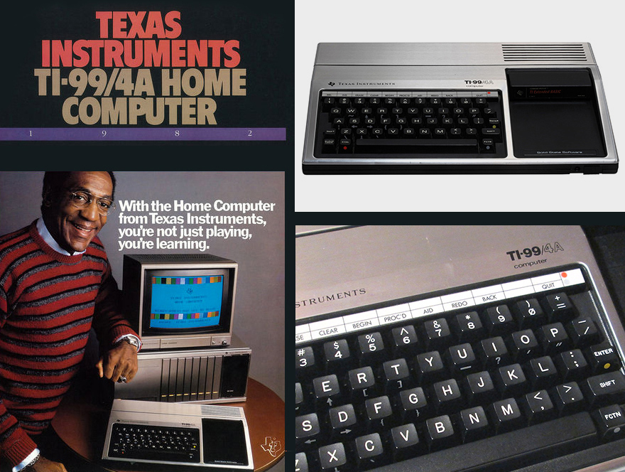
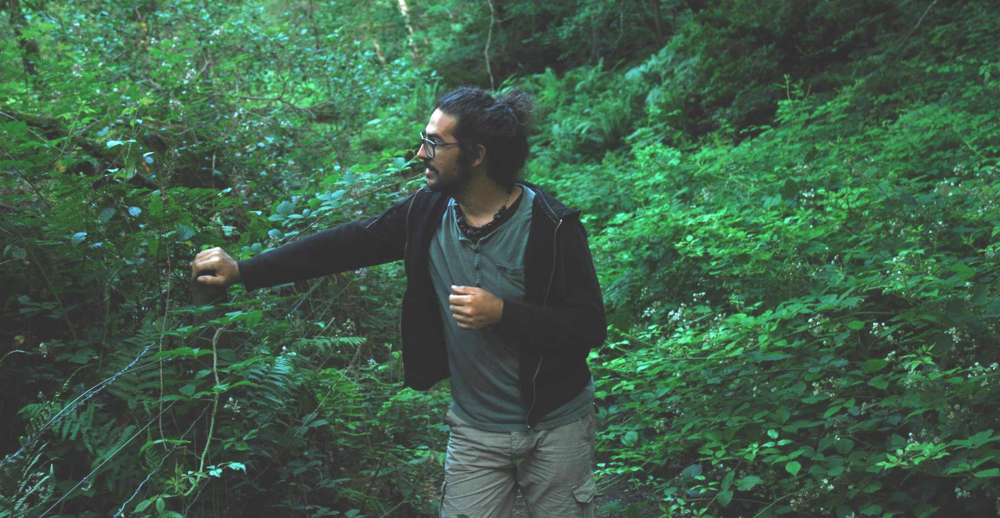
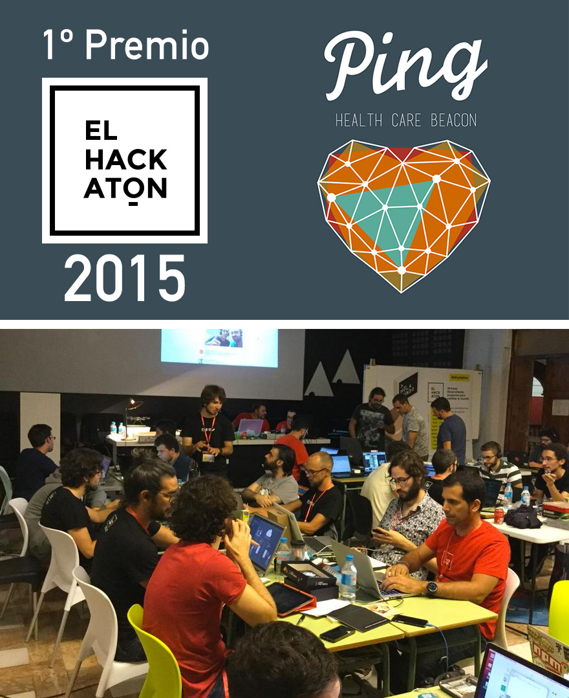
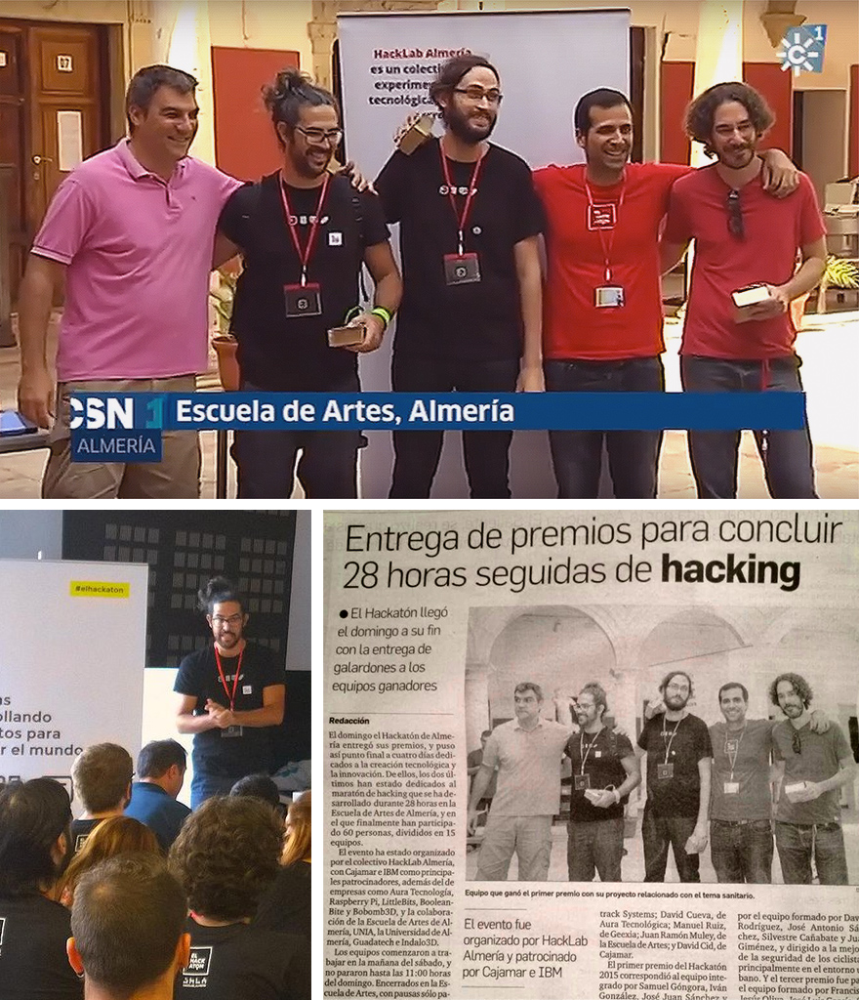
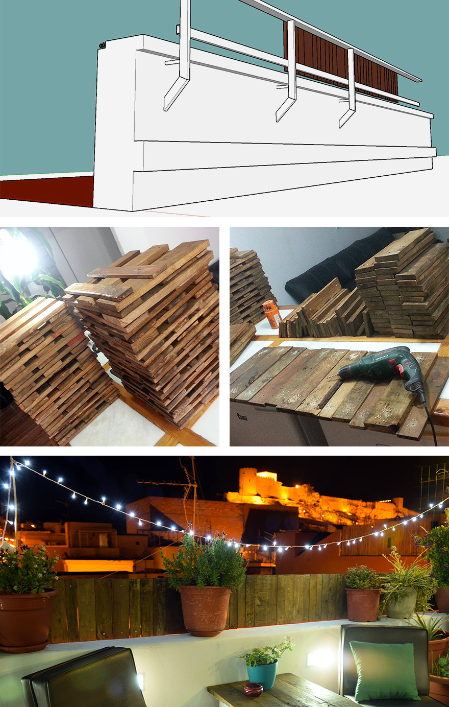
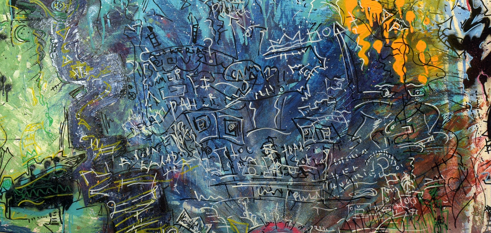
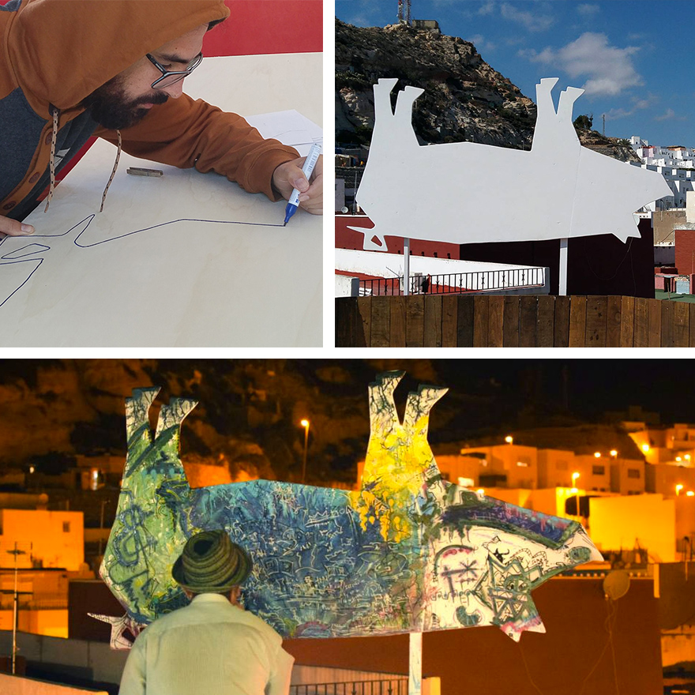

Comencé a programar con una Texas Instrument TI-99/4A cuando tenía 8 años, así que se podría decir que llevo casi toda mi vida programando!

Un RMMBR de la TI-99/4A //

Texas Instruments TI-99 TV Commercial - "This is the One!" - Featuring Bill Cosby //
[www.youtube.com/watch?v=DlU4HTefxmc](https://www.youtube.com/watch?v=DlU4HTefxmc)

Desde que apareció Internet por casa no he hecho otra cosa más que dedicarme al desarrollo web. Colaterlamente he aprendido cuestiones de diseño gráfico, imagen corporativa, contenidos digitales, fotografía, lenguaje audiovisual, edición de vídeo, modelado en 3D, etc.

{: .full }

### Ping Health Care Beacon // 1º Premio en el Hackaton 2015

28 horas desarrollando proyectos para cambiar el mundo.
Junto con mi equipo, ganamos el primer premio de esta maratón creativa basándonos en un problema real que afecta a muchísima gente en todo el mundo: el cuidado de las personas dependientes. La idea surge de mi experiencia personal ya que mi madre es diabética y en casa hemos estado siempre pendientes a que no le bajara el azúcar cuando estaba sola, ya que una hipoglucemia fuerte deriva en el coma y posteriormente en la muerte. El hecho de llamar por teléfono para ver cómo estaba y que no lo atendiera generaba una gran ansiedad en mi padre, haciéndole dejar el trabajo corriendo para volver a casa. La gran mayoría de las veces estaba bien, escuchando música fuerte, regando el jardín sin enterarse de nada. Todo quedaba en un susto, que a lo largo de la vida se traducía en muchos sustos.

Con la llegada de los smartphones, me surgió la idea de hacer una app para conectar su móvil con el mío, así cuando no me atendiese ni al teléfono fijo ni al móvil, simplemente dándole a un botón de esta app podría escuchar o ver qué sucedía alrededor de su móvil, saber si es que estaba escuchando música, si había silencio, o conectar con su GPS para saber dónde estaba, conseguir una pista que me indicara si se trataba de una situación de riesgo o no.

El proyecto que presentamos, Ping Health Care Beacon, planteaba crear un ecosistema de dispositivos que pudiesen monitorizar la actividad y los signos vitales de estas personas dependientes. Utilizar los dispositivos existentes en el mercado, smartphones y tablets, así como producir una serie de dispositivos específicos que optimicen dicha función de monitoreo.

Más info en: [elhackaton.com/2015/](http://elhackaton.com/2015/)

### De lo digital a lo físico

Ultimamente estoy tendiendo a aplicar estos conocimientos a proyectos personales, creativos y de desarrollo manual. Es decir, dejando un poco de lado el ordenador y trabajando más en procesos artesanales, como son la carpintería, restauración de muebles y edificaciones, utilizando lo digital para proyectar lo físico y tangible.

#### Barandilla metálica con madera reciclada // ChancaStyleParties

Desde el modelado en 3D, pasando por el proceso constructivo y terminando con el producto final. Más info en mi blog: [nubak.com/blog/barandilla-metalica-con-madera-reciclada](http://www.nubak.com/blog/barandilla-metalica-con-madera-reciclada)

#### Lienzo en madera para Street Art

Diseño y creación de un lienzo en madera para una performance de Street Art.
Más info en mi blog: [nubak.com/blog/plaka-street-art-kill-puerco-chancastyleparties](http://www.nubak.com/blog/plaka-street-art-kill-puerco-chancastyleparties)
{: .full }

