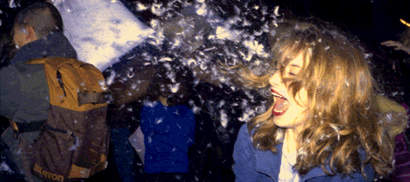
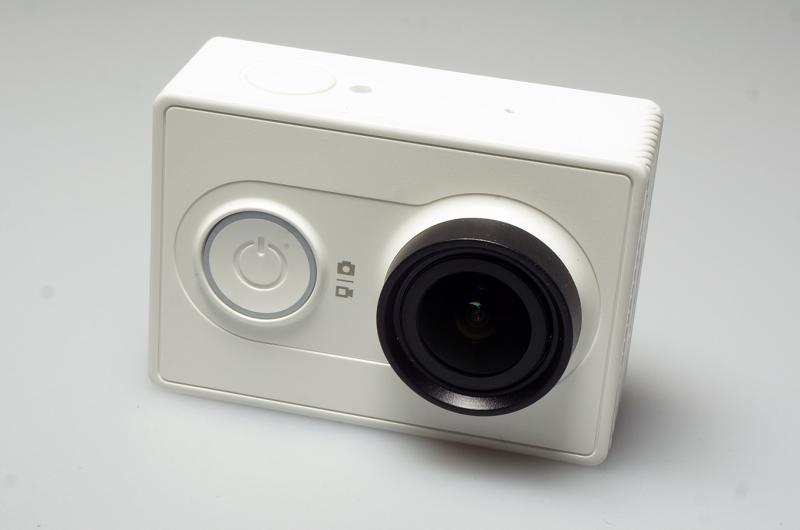
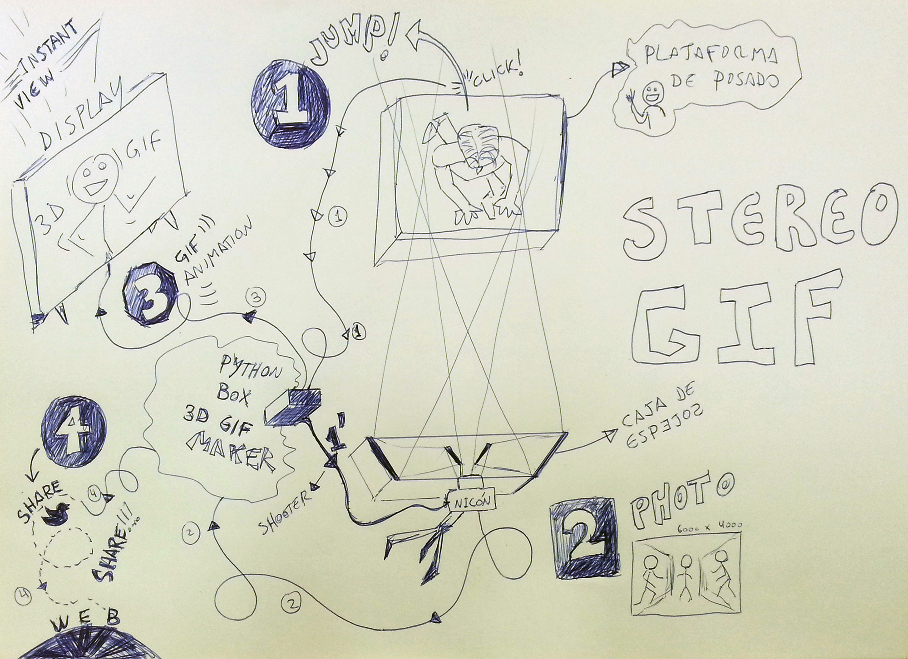
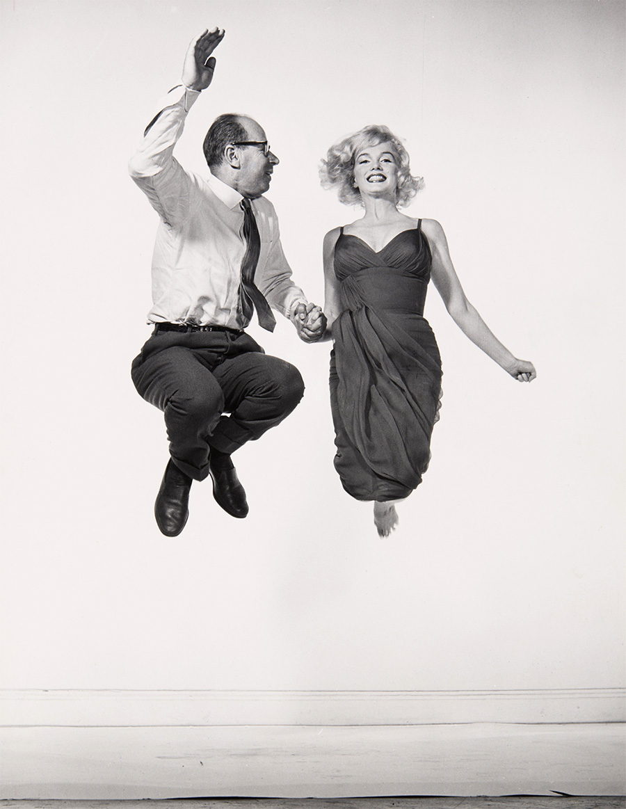
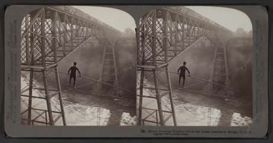

# 3D-Halsman

## Esta máquina te lleva al mundo del 3D, creando un GIF animado a partir de una captura fotográfica, espejos, electrónica y Python. 

(!gonnzo)

### Antecedentes

Hace tiempo me inspiró una vieja técnica en donde se sincronizaban varias cámaras analógicas y se capturaban tres o más imágenes al mismo tiempo para componer un gif animado que diese el efecto del 3D.

Fuente imagen: [konbini.com](http://www.konbini.com/us/entertainment/these-3d-gifs-explore-san-francisco-street-life/)

Comencé a jugar con la idea de sincronizar 3 cámaras Xiaomi Yi a través de algún tipo de configuración en el autoexec.ash, que permitiese disparar la cámara al obtener una luminosidad alta originada por un flash. Pero no encontré la solución ahí.

Luego se me ocurrió que no todo tiene que pasar por la programación. Me imaginé un modo mecánico, no invasivo, para soportar 3 cámaras iguales, y a modo de gatillo, una palanca que hiciera presión en los botones de disparo al mismo tiempo. Algunos calificarían de cutre esta solución, pero al menos era una solución factible y muy simple.

Finalmente, me di cuenta que los GIFs animados no suelen ser muy grandes, ya que a mayor tamaño mayor es el peso del archivo. Así que resolví usar una sola cámara y un juego de espejos. Con esto resolvía dos cosas, la sincronización ya no era necesaria y el coste del proyecto se reducía a una sola cámara. Una foto fija de la Xiaomi Yi tiene más de 4600 píxeles de ancho, por lo tanto si dividía esta imagen para capturar un "3-en-1" podía obtener más de 1500px de ancho por GIF animado.

Hice un juego de espejos en donde enfrenté dos de ellos a 45 grados del objetivo, apuntando hacia afuera, y otros dos en los externos apuntando hacia delante. Entre los dos primeros dejé un pequeño hueco, por donde obtenía la imagen frontal, y de los espejos externos obtenía una imagen lateral izquierda y lateral derecha.

Tome una fotografía con el juego de espejos haciendo equilibrio (todos sueltos para poder regular los ángulos y separaciones). Tenía pensado hacer un "Action" en Photoshop  para automatizar el recorte, corrección de distorsión y disposición de las imágenes en el timeline para exportar el GIF de forma sistemática. Pero no me pude esperar y lo hice a mano. **La prueba fue un éxito.** Aunque no pueda mostrar el GIF (por derechos de imagen) os aseguro el resultado fue más que satisfactorio. 

### Retomando este proyecto desde Pymiento

Ya formando parte de Pymiento, se me ocurrió hacer una plataforma que tomara la fotografía automáticamente cuando el sujeto diera un salto ➀. Que de alguna forma saliera de la cámara ➁ y un programa en Python la procesara para crear el GIF animado y lo mostrara en una pantalla ➂. Por último, la persona podría enviar un Twitter y compartir el GIF en sus redes sociales ➃.

(full)

Cuando comenté la idea del proyecto en la reunión, mencioné que era interesante sacar fotos de la gente saltando porque la ropa y los pelos "toman vuelo" creando más volumen y profundidad en el efecto 3D, al igual que si se tiran confetis, o plumas como en el ejemplo de la primera foto. En ese momento, Adolfo hizo una apreciación interesante. 

(!adolfo)

### El nombre del proyecto en honor a Philippe Halsman

Philippe Halsman fue un reconocido fotógrafo de los años 50 que le propuso a cada famoso y persona importante de la época saltar para él, para ser fotografiado por los aires. Lo que decía Halsman era que la gente tiende a disimular sus expresiones cuando se está bajo control y en reposo, así que desde la más genuina curiosidad, lo que pretendía con esto era descontrolar ese reposo y ver a la gente famosa revelando sus ambiciones o la falta de estas, ver si eran presumidos o si eran inseguros, entre otros muchos rasgos.  

Fuente: [Philippe Halsman's Jump Book](http://philippehalsman.com/?image=jumps)

> "Starting in the early 1950s I asked every famous or important person I photographed to jump for me.  I was motivated by a genuine curiosity.  After all, life has taught us to control and disguise our facial expressions, but it has not taught us to control our jumps.  I wanted to see famous people reveal in a jump their ambition or their lack of it, their self-importance or their insecurity, and many other traits." –P.H.

(!gonnzo)

### images2gif con Python

Mientras descubríamos cómo controlar la cámara, una de las tareas que había pendiente era conseguir transformar la imagen que proviene de la cámara en un GIF animado, usando Python. Así que partiendo de esta imagen de ejemplo:

(natural)

Utilizando [images2gif](images2gif/images2gif.py) desarrollé este script de prueba con el que conseguí generar un GIF animado a partir de fragmentos de una misma imagen:

 # -*- coding: utf-8 -*-
#	File: 3dhalsman-gif-test.py
#	Author: Iván Gonzalo Moyano
#	Proyect: Pymiento
#	Date: 08 Sep 2016
# -*-----------------*-
\n
from PIL import Image                                                                          
from images2gif import writeGif
\n
gif_width = 175
gif_height = 175
\n
image_origin = Image.open('demo.jpg')
frame1 = Image.new(image_origin.mode, (gif_width, gif_height))
frame2 = Image.new(image_origin.mode, (gif_width, gif_height))
\n
position1_x = 51
position1_y = 30
position2_x = 235
position2_y = 30
\n
box1 = (position1_x, position1_y, position1_x + gif_width, position1_y + gif_height)
box2 = (position2_x, position2_y, position2_x + gif_width, position2_y + gif_height)
\n
frame1.paste(image_origin.crop(box1))
frame2.paste(image_origin.crop(box2))
\n
frames = []
frames.append(frame1)
frames.append(frame2)
\n
writeGif("3d.gif", frames, duration=0.1, dither=0)

(natural)

(!aitor)

### Planteamiento artístico

Transformar el mecanismo lineal y previsible de: "salto / saca foto / genera GIF / obtengo GIF" en un comportamiento ligeramente diferente.

Hacer que debajo de la plataforma de salto se esconda una báscula para obtener su peso, y utilizando la propia cámara (o una complementaria) e implementando un script con [OpenCV-Python](https://opencv-python-tutroals.readthedocs.io/en/latest/) se podría obtener la estatura estimada del sujeto.

Con estos datos, se puede calcular el [Indice de Masa Corporal](http://www.calculoimc.com/) y establecer si el sujeto tiene una complexión delgada, normal o de sobrepeso. Cuando esta persona fuese a obtener su **GIF animado** se encontraría que en cambio, lo primero que reciba es el resultado del **Indice de Masa Corporal**, recordándole que no leyó la letra pequeña del artefacto y que, la máquina además de hacer lo que parecía que hacía, obtuvo información personal bajo el consentimiento implícito al subirse en ella. Por último recibiría su GIF animado. 

> El objetivo de esta propuesta es dar un toque de atención a la gente con respecto al uso que le estamos dando a la tecnología. Recordar que no todo lo que dice o parece ser realmente es. -A.Á.  

(!gonnzo)

### Propuesta All-in-one Xiaomi Yi / Linux / Python

Volviendo a la cámara Xiaomi Yi y teniendo en cuenta que en su interior corre una versión de Linux, el planteamiento que hago es el siguiente: ¿por qué no integrar todo el proyecto dentro de la cámara? Es decir, instalarle Python (si no lo tiene instalado), las bibliotecas necesarias para trabajar con el GIF, etc, y usar su conexión WiFi para exportar el resultado a algún servidor externo vía FTP o similar. Dejo esta puerta abierta a ver si alguien se anima y me echa una mano en esta linea. 