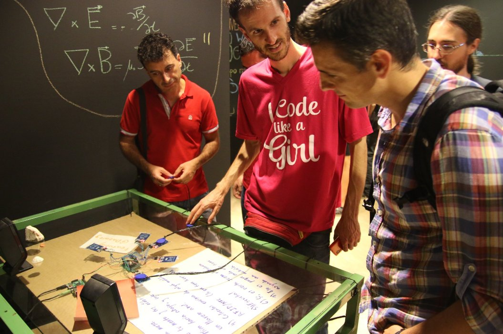

Aportación de: <a href="../../people/francisco-acien.html">Fran Acién</a>

 

Los módulos RFID/NFC se suelen utilizar para abrir y cerrar puertas, que tal si cambiamos las llaves por instrumentos y las puertas por altavoces, que conseguirmos un instrumento que a la par de ‘guai’ es raro.

Cada chip nfc tiene asignado un sonido, cuando este entra en algún módulo este empieza a sonar. Así podemos tener diferentes sonidos como una batería, una guitarra, una voz, un golpe en seco, etc. que el usuario puede meter o sacar de su obra musical y crear una canción. Los módulos NFC's es el escenario metafórico, que al entrar algún chips, este empiza a tocar como si de un concierto se tratase. Al salir del escenarion, la melodía del módulo para.

 <iframe width="560" height="315" src="https://www.youtube.com/embed/0RvY7xLZidY" frameborder="0" allowfullscreen></iframe>

Podríamos tener una mesa llena de muñecos de diferentes instrumentos, que cuando entra en el escenario empieza a tocar la melodía que tiene asignada. Tocar música pasa de ser algo muy matemático a guiarse por la pura intuición.

El proyecto consta de un arduino nano, 5 módulos nfc, una raspberry pi. Los módulos nfc se comunican con el arduino por medio de SPI, el arduino le pasa los datos a las raspberry pi por serial, y la raspi pone los audios.

##Repositorio del proyecto
Todos los archivos, esquemas, scripts, etc. están en el [repositorio de github de Pymiento](https://github.com/PymientoProject/MusicaFiguras)

##Licencia
Este proyecto está licenciado bajo GPL v3

