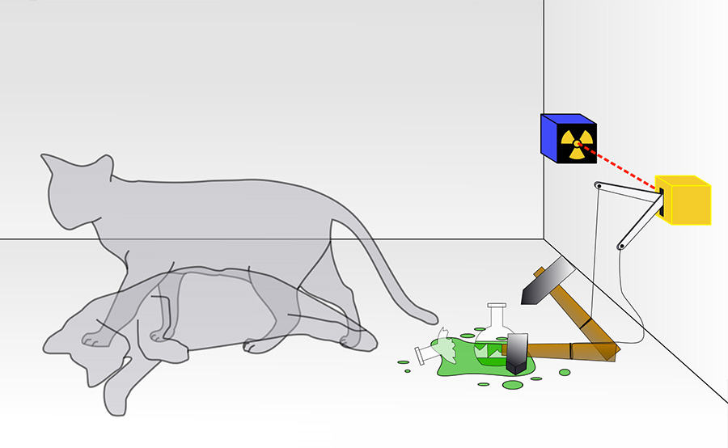
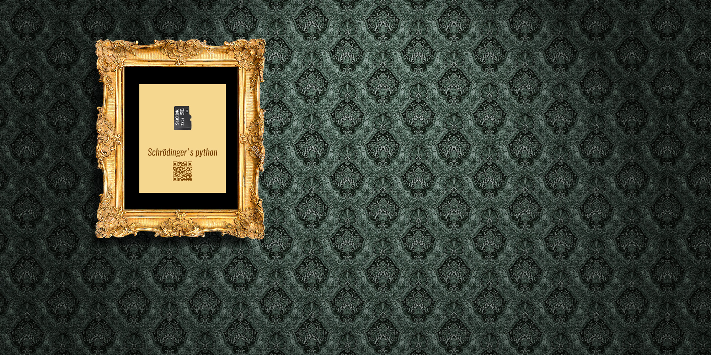

Aportación de: <a href="../../people/gonzalo-moyano">Gonzalo</a>

 

Basado en la idea original de nuestro amigo [Juan de Dios](https://www.youtube.com/channel/UCBhkLrsmV9PVQMpT3qe-toA), que dijo "Si meten Python en una memoria y la enmarcan en un cuadro... ¿sería una obra de arte hecha con Python?", este proyecto va un poquito más allá y complementándolo con la paradoja de Schrödinger, plantea al existencia e inexistencia de código Python dentro de la MicroSD mientras no se este observando.

### La propuesta de Erwin Schrödinger 

Plantea un sistema que se encuentra formado por una caja cerrada y opaca que contiene un gato en su interior, una botella de gas venenoso y un dispositivo, el cual contiene una sola partícula radiactiva con una probabilidad de 0.5 de desintegrarse en un tiempo dado, de manera que si la partícula se desintegra, el veneno se libera y el gato muere.
{: .content }

Al terminar el tiempo establecido, la probabilidad de que el dispositivo se haya activado y el gato esté muerto es de 0.5, y la probabilidad de que el dispositivo no se haya activado y el gato esté vivo tiene el mismo valor. Según los principios de la mecánica cuántica, la descripción correcta del sistema en ese momento (su función de onda) será el resultado de la superposición de los estados «vivo» y «muerto» (a su vez descritos por su función de onda). Sin embargo, una vez que se abra la caja para comprobar el estado del gato, éste estará vivo o muerto. // Fuente y más info: [wikipedia.org](https://es.wikipedia.org/wiki/Gato_de_Schr%C3%B6dinger)

// Diseño conceptual de la obra //

Inicialmente, me imaginé un cuadro imponente, de grandes dimensiones, con un marco y fondo dorado y un paspartú negro. Y justo en medio, una insignificante memoria MicroSD albergando (o no) el código Python. Simplemente esto. Nadie sería capaz de acceder a la memoria ni saber de la existencia de su contenido, creando con este hermetismo la paradoja de Schrödinger. Pero esta propuesta, tal como estaba planteada cayó, por no cumplir con los requerimientos de un proyecto de laboratorio. Sólo era arte provocativo, sin más.

Aportación de: <a href="../../people/adolfo-rosillo-herrera-html">Adolfo</a>

 

Gracias a estas apreciaciones de Adolfo, movemos el proyecto al siguiente punto: interacción y experimentación. Planteamos la idea de que la persona que visite la obra pueda observar el contenido de la memoria. Se planteó reemplazar la MicroSD por una memoria USB, a la que se podía acceder dede el exterior, pero claro, prácticamente nadie anda con su portatil visitando un museo. Una conección al móvil con [USB On-The-Go](https://es.wikipedia.org/wiki/USB_On-The-Go) era otra posibilidad, pero también es verdad que no todos los móviles soportan esta tecnología. 

Por otra parte, si accediesen a la memoria ¿qué se suponia que iban a encontrar? Sencillamente, o código en Python o nada. No era posible automatizar un sistema dentro de una memoria que fuese capaz de mostrar aleatoriamente (con una probabilidad del 0.5) código Python o no. Esto nos llevó a salir fuera. Simular el concepto. 

