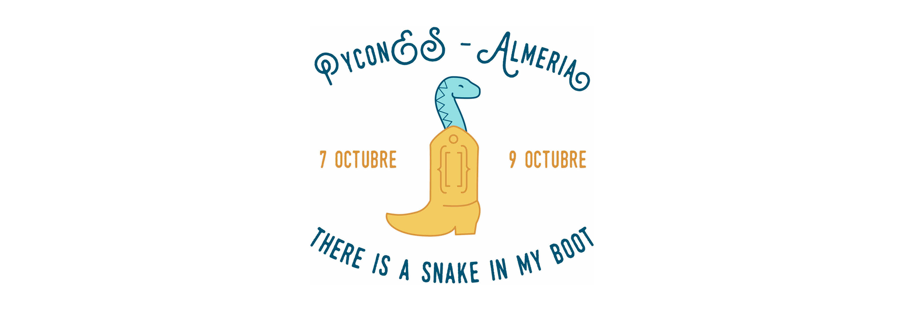
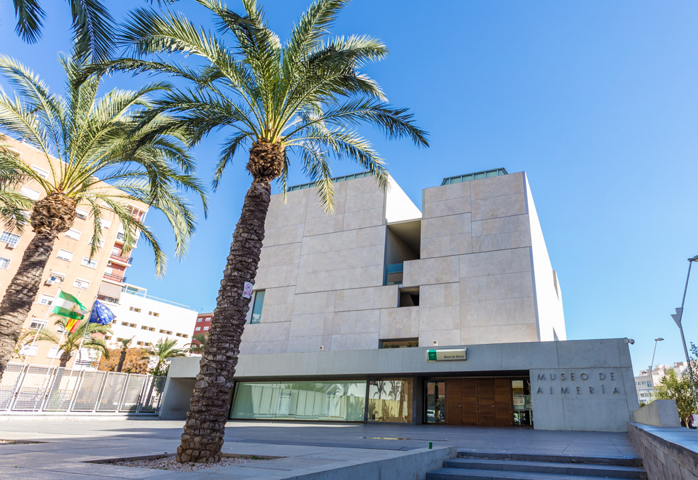
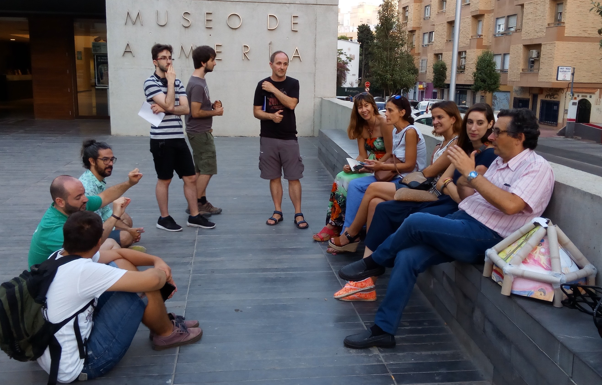
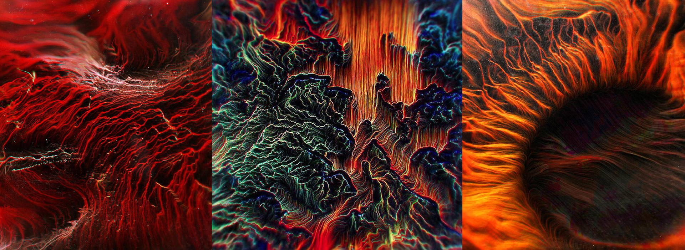
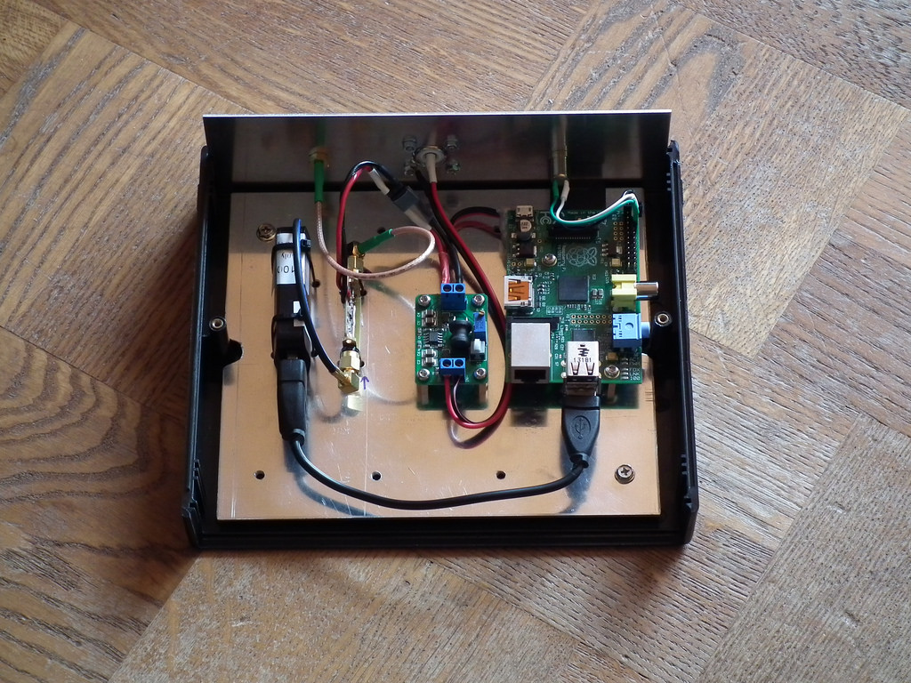

# About // Todo sobre Pymiento

## Esta es una historia inacabada. Se lee desde abajo hacia arriba. Lo primero que veas es el presente, y hacia abajo, un paseo por el historial completo del proceso creativo.

### Deadline // Sobre PyCon y PyConES

[PyCon](http://www.pycon.org/) es la mayor conferencia anual de la comunidad de usuarios y desarrolladores del lenguaje de programación de código abierto Python. A nivel nacional tenemos la [PyConES](http://2016.es.pycon.org/es/), que se ha venido celebrando en Madrid, Zaragoza y Valencia en años anteriores.

Este año se celebrará en Almería, a lo largo de los días 7, 8 y 9 de Octubre, repartiendo el evento entre la Universidad y el Museo de Almería. Nos hemos colado en el evento, tanto dando una conferencia como con la exposición de nuestro proyecto experimental de creación ciudadana.

(full)

### Exposición // Museo de Almería - Python España

Jose Luis Sampedro, en su infinita sabiduría decía **_... estamos en este mundo para vivir, para realizarnos, para dar de cada uno de nosotros todo lo que puede dar, porque así tendrá todo lo que pueda recibir..._** Pues debe de ser verdad, porque empezamos sin nada, compartiendo lo poco que tenemos, y no hemos parado de recibir. Un ejemplo de esto es que tanto [Python España](http://www.es.python.org/) como el [Museo de Almería](http://www.museosdeandalucia.es/cultura/museos/MAL/) nos abrieron sus puertas. Vamos a exponer nuestro laboratorio de participación ciudadana en la sala Arrob@ del museo. La inauguración tendrá lugar el día 8 de octubre a las 20hs y estará disponible hasta el día 6 de Noviembre.

Durante el mes de exposición, haremos talleres _in situ_, donde poder enseñar a los asistentes a iniciarse en el mundillo Pymientero.

Fuente imágen // [www.filmingalmeria.es](http://www.filmingalmeria.es)

### El equipo // Somos personas, no recursos

Todo esto no sería posible sin el grupo humano que hay detrás. Empezamos siendo tres individuos, y el número se ha multiplicado por 5,x. Está compuesto de personas de distintas edades y oficios, porque como dice Pau Donés **_"...la pureza está en la mezcla, en la mezcla de lo puro, que antes que puro fue mezcla"_**. Hay personas del diseño, la creatividad, ingenieros **¡¡¡Lo peor de cada casa!!!** Cada uno conseguimos aportar nuestro granito de arena, ya que hemos tirado la careta de los prejuicios a la basura y estamos abiertos a los demás. Pero Pymiento no está abierto solo para lo local. Contamos con parte del equipo trabajando desde otros lugares, colaboradores externos. Ni los conocimientos son una traba para participar, ni la distancia tampoco. Así que si quieres unirte en este viaje, acabas de ser invitado.  

(full)

### Python como herramienta // ¿Mundo Virtual (SW)? ¿Mundo Físico (HW)?

[Python](https://www.python.org/) es uno los lenguajes de programación mas *sui generis* que existen. **Basa su potencia en el minimalismo y la usabilidad**, [estos son sus principios](https://www.python.org/dev/peps/pep-0020/). Se postula como de una de las mejores elecciones para aprender a programar ¿Que podemos hacer nosotros? Entre la comunidad artística cada vez es más frecuente su uso, pero es un terreno por arar todavía. Empezamos a dar nuestros primeros pasos con el software [Proccesing en su versión Pythonista](http://py.processing.org/). Un mundo nuevo se abría ante nuestros ojos, **Arte Generativo**. Con pocas líneas de código podíamos pintar nuestras pantallas con cuadros con los que nunca hubieramos soñado.

(full)
Fuente imágenes: [Robert Hruska](https://instagy.com/user/rbrthrsk) // [fb.com/rbrthrsk](https://www.facebook.com/rbrthrsk)

El mundo virtual es un sitio fascinante, lleno de conocimiento y recursos. Nosotros tenemos la suerte de vivir en el mundo físico, donde hay sabores, olores y sonrisas que dan calor ¿Acaso Python no sirve para nuestro mundo? Gracias a proyectos como [Arduino](https://www.arduino.cc/), la evolución del movimiento *maker* ha hecho que podamos hacer saltar chispas con la serpiente ¿Con que? Pues con placas electrónicas como [Raspberry Pi](https://www.raspberrypi.org/blog/) por ejemplo.

(full)
Fuente imágenes: [Rocketcam 1](https://www.flickr.com/photos/csete/14307618084/in/album-72157644517281737/) // [csete](https://www.flickr.com/photos/csete/albums/72157644517281737/with/14121544478/)

Resulta que contamos con un abanico bastante amplio y asequible con el que poder trabajar, ahora toca ver donde queremos aplicarlo.

### Punto de partida // Los principios

Entre los saraos grandes que hemos venido organizando, este año tenemos el orgullo de decir que somos la sede del [congreso nacional de Python](http://2016.es.pycon.org/es/). Teniendo este evento como objetivo, un grupo de 3 inquietos creamos una rama de Hacklab Almería a parte y la llamamos Pymiento ¿Nuestra pretensión? Crear un grupo de experimentación con índole artística, que teniendo Python como hilo conductor, aborde el congreso con un punto de vista diferente.

### Antecedentes // La era del Pre-Pymiento

En **2013** surge en **Almería** un **grupo** de inquietos que comenzaron a juntarse con la intención **compartir conocimientos, aprender los unos de los otros entorno a la tecnología** y lo llamamos **[Hacklab Almería](hacklabalmeria.net)**. Empezamos montando [pequeños saraos](http://hacklabalmeria.net/actividades/) mensuales para reunirnos, y luego [saraos más grandes](http://elhackaton.com/2015/) para atraer a más gente. Bajo la filosofía del conocimiento libre, y el Open Source Hardware, hemos creado una comunidad de comunidades en nuestra ciudad. Somos un paraguas donde todo el talento que more por estas tierras tenga un cobijo.

En HackLab Almería **somos un colectivo de experimentación tecnológica, social y creativa.**
(full)

Pasa por nuestro [Foro](https://foro.hacklabalmeria.net/), o háblanos por [Telegram](https://telegram.me/joinchat/AFGSKT5buk53IvM55CUsSQ), somos gente de bien y tenemos ganas de conocerte.
