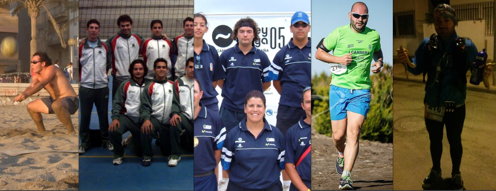
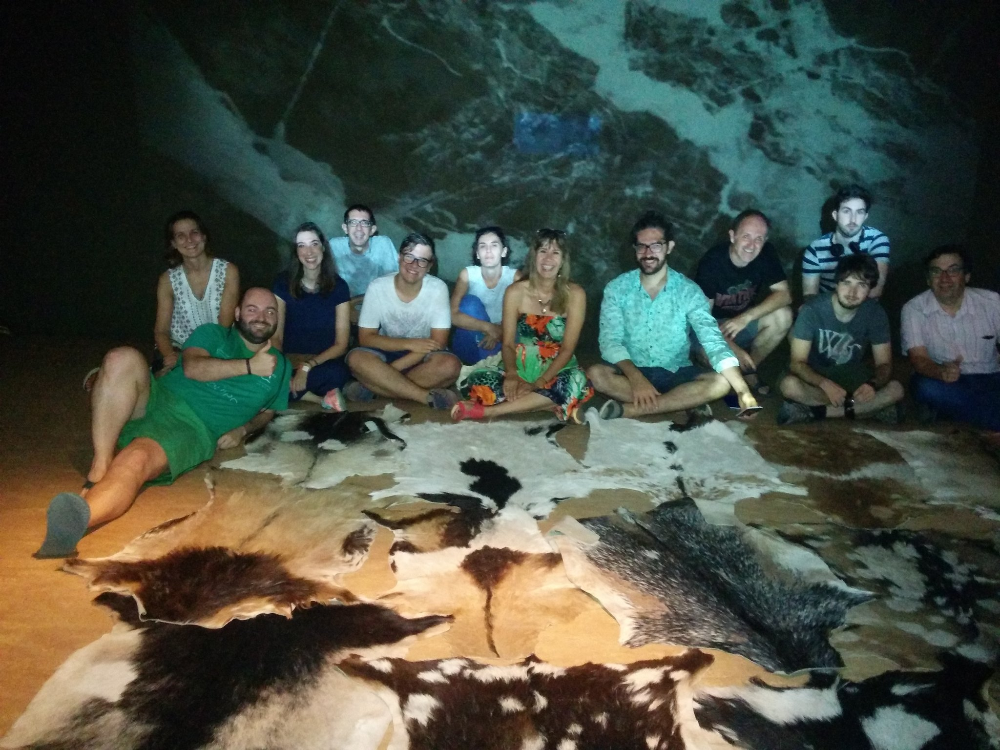

# Cristóbal Contreras Rubio

## Ecléctico por vocación, flamer por vocación

De chico me decían que era muy listo, no debí de crecer. Dedico todos mis esfuerzos en aprender cada día algo nuevo de un tema distinto. **Mi método de aprendizaje** es sencillo, pero no es ni bueno ni recomendable. Consiste en **salir constantemente de mi zona de comfort**, así que podemos decir que soy un **especialista en _mear fuera del tiesto_**. He descubierto que **mi mejor escuela son mis errores**, y son tantos ya que empiezo a pasar de curso sin apoyo. Quizás por todo esto es que **siempre hago cosas que me suponen un reto**. Dado que soy una persona abocada al fracaso por definición, **compenso mi falta de talento con disciplina y trabajo duro**.

Gran **parte de mi vida** la he dedicado al **deporte** *"men sana in corpore sano"*. Dado que soy bajito y salto poco, siendo fiel a mis principios, decidí que el voleibol era el mejor deporte donde podía esforzarme más. Y durante toda mi vida he jugado a **voleibol y voleyplaya**. Es un **deporte de equipo** donde la **técnica**, la **anticipación**, pero sobretodo, el **compañerismo**, son los **factores clave** para poder conseguir victorias.  Cuando ya resultó imposible poder reunir a más gente para jugar, tuve que seguir haciendo **deporte por mi cuenta**. Como soy casi asmático, decidí **correr**, progresivamente aumententaba distancia y he llegado a participar en **una ultra trail (90km).** De esta faceta deportiva **aprendes cosas como** la **constancia**, el saber **administrar** tus **recursos**, y **entender que** solo sigues adelante porque tu cabeza está convencida de ello (**resiliencia**).

(full)

La otra gran **parte de mi vida** la he dedicado a **la tecnología, y** ahora más a **las personas**. Mientras obtenía el título de ing. de Telecomunicación descubrí que me gustaban los procesos por los que se llegaban a las soluciones, su razonamiento, la manera de pensar, más que las propias soluciones en si. **Laboralmente** traté y trato de enfocarme al **I+D**, pero a lo que he **dedicado más tiempo** ha sido en **colaborar** la mejor **comunidad** de geeks que conozco, [HacklabAlmería](http://hacklabalmeria.net/). Gracias a esto he podido conocer cosas como el **Open Source**, cultura del **procomún**, cultura **maker** y a **maravillosas personas**. Juntos, poco a poco, **hemos ido organizando saraos (talleres, jornadas,** [hackatones](https://www.youtube.com/watch?v=Obs48TFqWXU&list=PLLivOTC-7fDR_6SXro2Ct80QM5S7jKnz4) , etc), **charlas, y eventos de todo tipo**. Personalemte incluso he tenido la posibilidad de poder hacer pedagogía de todo esto en conferencias. Simplemente somos **#GenteQueHaceCosas**

(full)

Y de **esos barros, estos lodos**. Decidimos un par de locos que teníamos que **dejar** el **STEM** de lado y **aplicarnos** el **STEAM**, con una A bien grande. Desde el absoluto respeto, pero sin ningún tipo de complejos, creemos que **la tecnología no es solo para ingenieros, ni la creatividad solo para artistas**. Así que nos pusimos manos a la obra, **empezamos a juntarnos con otras personas, sin prejuicios, solo con ganas de compartir y hacer**. A este maravilloso experimento social lo hemos llamado Pymiento.

(full)
