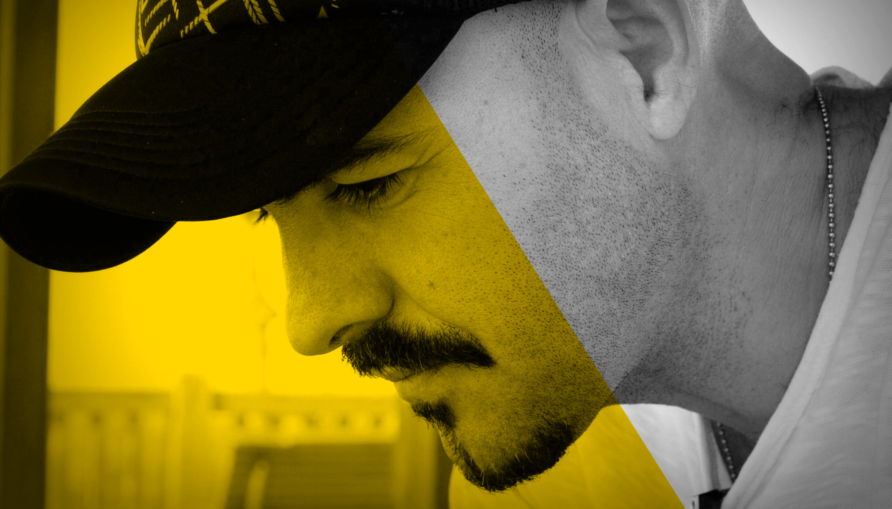

# Favio Gutierrez

## Diseño y Comunicación Visual

Licenciado en Diseño y Comunicación Visual, creativo, apasionado por el branding, las nuevas formas de comunicación y la publicidad.

Ha ejercido puestos de responsabilidad en la comunicación de Empresas de Proyección Internacional, Nacional y Regional. Agencias de comunicación, de publicidad y estudios de diseño, han sido la base de su prospección profesional.

Creador de [faviogutierrez.com](http://www.faviogutierrez.com), estudio multidisciplinar donde dirige  y coordina a otros profesionales freelance desde hace doce años, ofreciendo servicios de estrategia, desarrollo y producción en el ámbito de Branding, diseño web y marketing digital.

(full)
