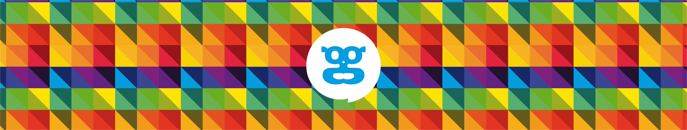
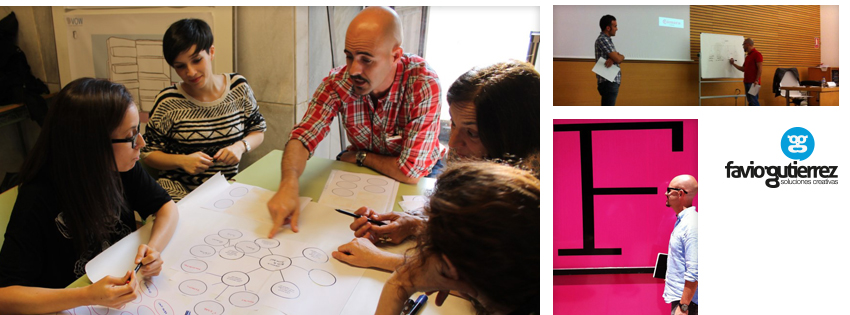
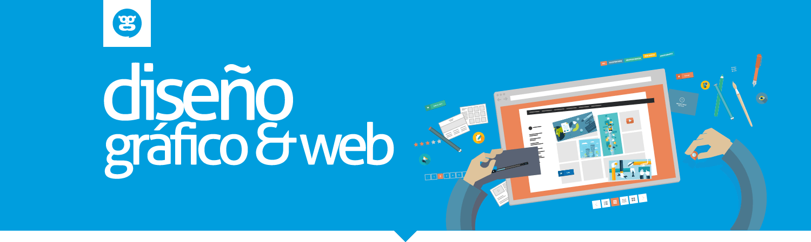
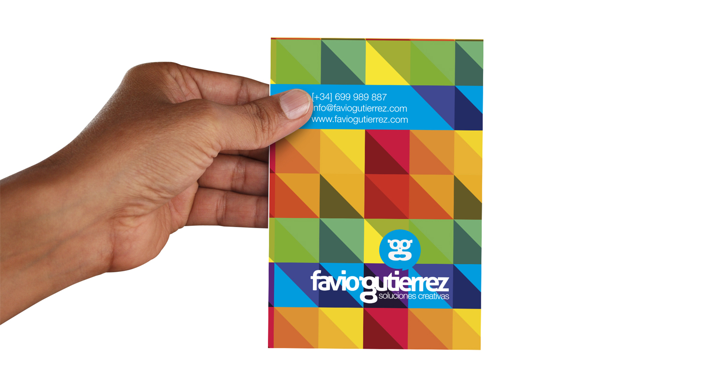

# Favio Gutierrez

## Diseñador gráfico todoterreno

Diseñador gráfico, fan absoluto de las nuevas tecnologías, y papá al uso ;-)

Licenciado en Diseño y Comunicación Visual, formado y experimentado en múltiples disciplinas de diseño gráfico y web.

Apasionado por el branding, amante de las tipografías y curioso de las nuevas formas de comunicación visual, soy el que ayuda a que tu imagen venda!

Varios años de bagaje en estudios de diseño en Buenos Aires me proporcionaron la experiencia, la seguridad y los conocimientos para volar, y así llegué a España, hace ya más de quince años.
(full)
 

### ¿Qué hago aquí?

Desde hace doce años, gestionar mi propio estudio de diseño, a la vez, dirigir y coordinar el proyecto faviogutierrez.com, dónde y junto a otros profesionales freelance ofrezco servicios de estrategia, desarrollo y producción en el ámbito de Branding, Diseño Web y Marketing Digital.
 

### Experiencia

Agencias de comunicación, publicidad y diseño han sido los culpables de todo lo que hasta ahora he aprendido y practicado, aunque, y dicho sea de paso, el Master en Marketing Digital y eCommerce me ha ayudado a seguir en órbita y a mantenerme al día en esta rueda loca que gira cada vez más rápido de la mano de internet.

(full)
(full)
 
Practicar sinergia entre personajes de distintos ámbitos me ha permitido conocer e interactuar en diversos sectores de actividad.
 
Durante la primera movida tecnocientífica que se celebró en Almería (Hackaton 2014), conocí a Cristo y a Adolfo, ellos me contagiaron sus ideas y sus ganas de hacer cosas nuevas, diferentes, innovadoras  y aquí estoy aportando un granito de arena a Pymiento Project.
Potenciador de la sinergia entre personajes de diferentes sectores me incentivó a colaborar en este gran proyecto.

(natural)
(full)

