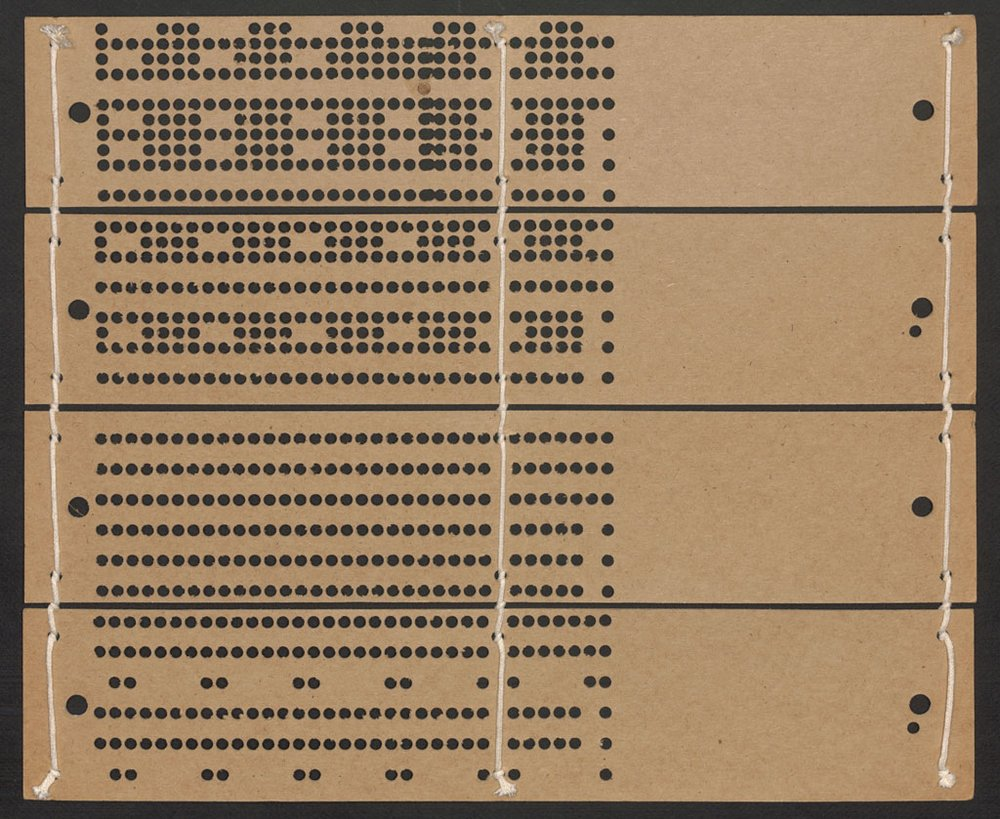
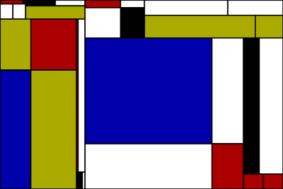
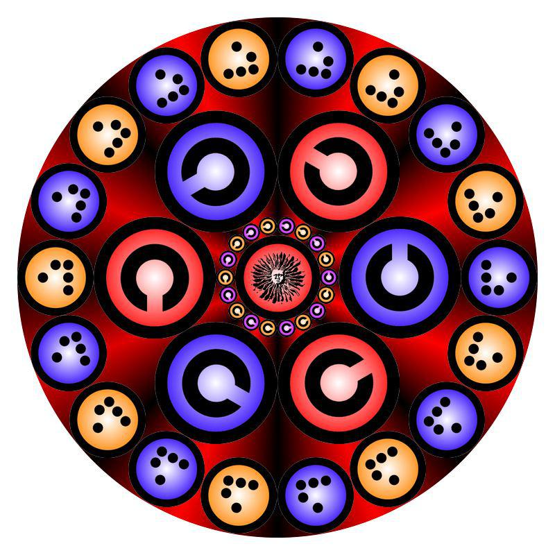
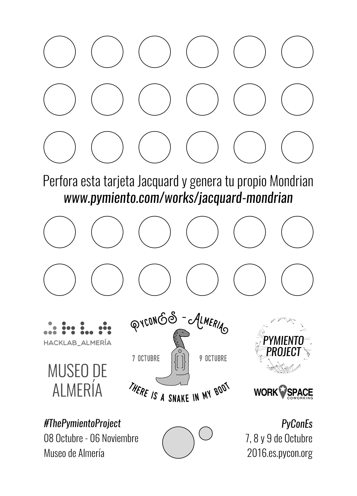

# iJacquard

## ¿Mandalillo o Mondrian? Solo tu código lo dirá

Aquí tenéis **nuestro flyer** de presentación, la tarjeta de visita. Con este proyecto queríamos demostrar que cualquier persona puede aportar en un campo de conocimiento en el que a priori no tiene porque ser el suyo. Esto quiere decir los campos del saber no son **cotos privados de caza** donde solo manejan los dueños, sino que es patrimonio de todos, lo único que necesitas es tener ganas de hacer cosas.

Nos hemos basado en el diseño de la [tarjeta perforada del Telar de Jacquard](https://es.wikipedia.org/wiki/Telar_de_Jacquard), que es la **primera tarjeta de computación** que existe (allá por el **año 1725**). Esta tarjeta se usaba **en un telar**, para **hacer ropa y alfombras, no para cálculos de balística ni jugar al pong**.

Nuestra tiene unos agujeros preperforados donde cada persona puede quitar los que quiera. Posteriormente la tarjeta se mete en una máquina, nuestro "telar", donde la analiza y en vez de tejer prendas,lo que crea son cuadros. Puede ser un Mondrian...

Puede ser un mandala...

La cuestión es que **el mero espectador**, que **no tiene ni porque saber informática, pero** es de hecho el que **programa el cuadro**. Una acción tan nimia como **quitar agujeritos con el dedo en un flyer publicitario, genera un algoritmo que reproduce algo en pantalla**. Y **lo has hecho tu querido espectador**, no lo ha hecho la NASA ni Google, aquí ¡¡¡**el prota eres tu**!!!

