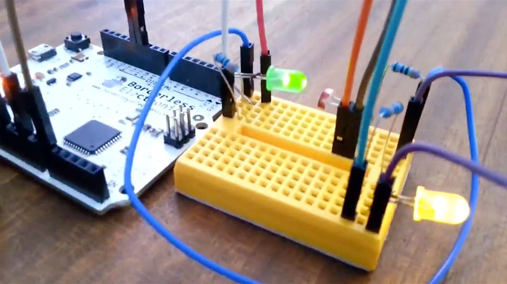
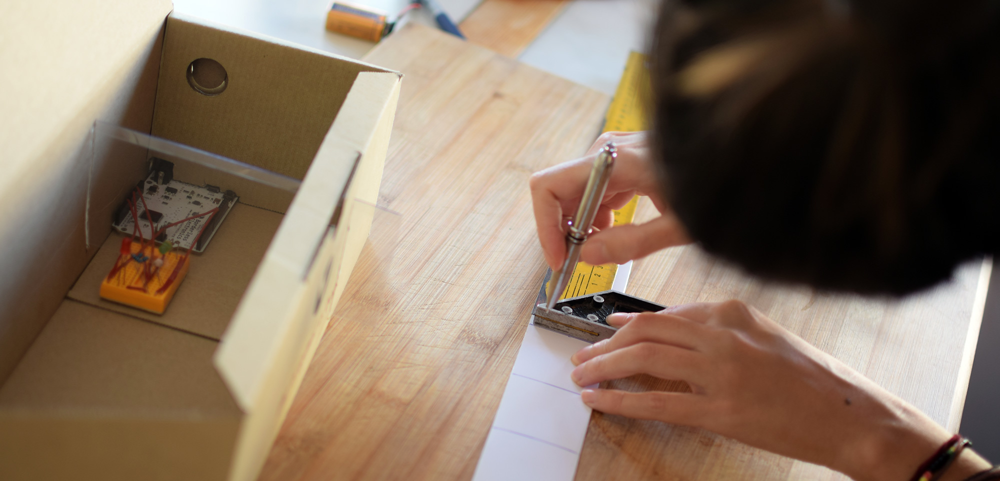
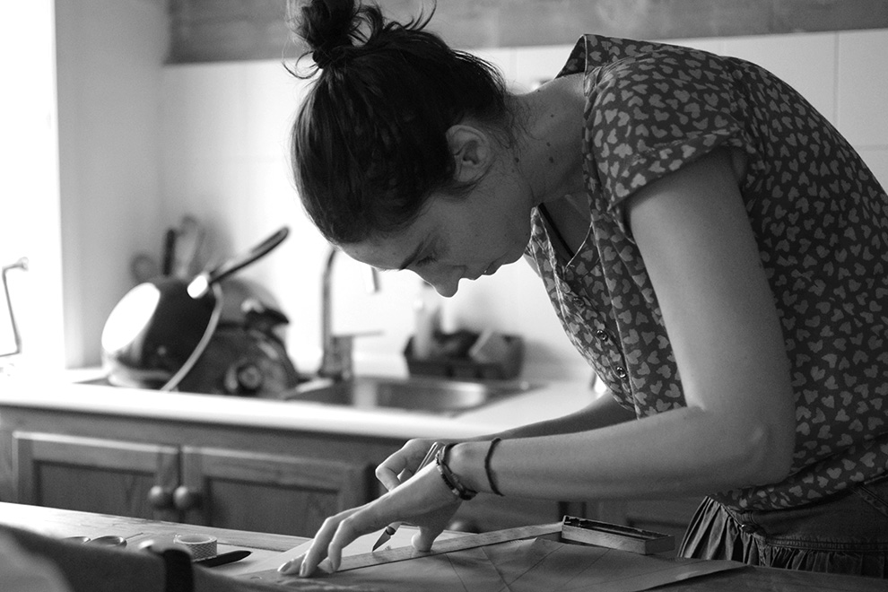
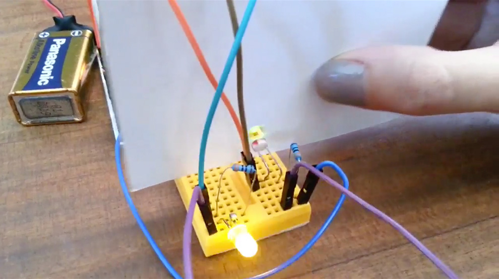
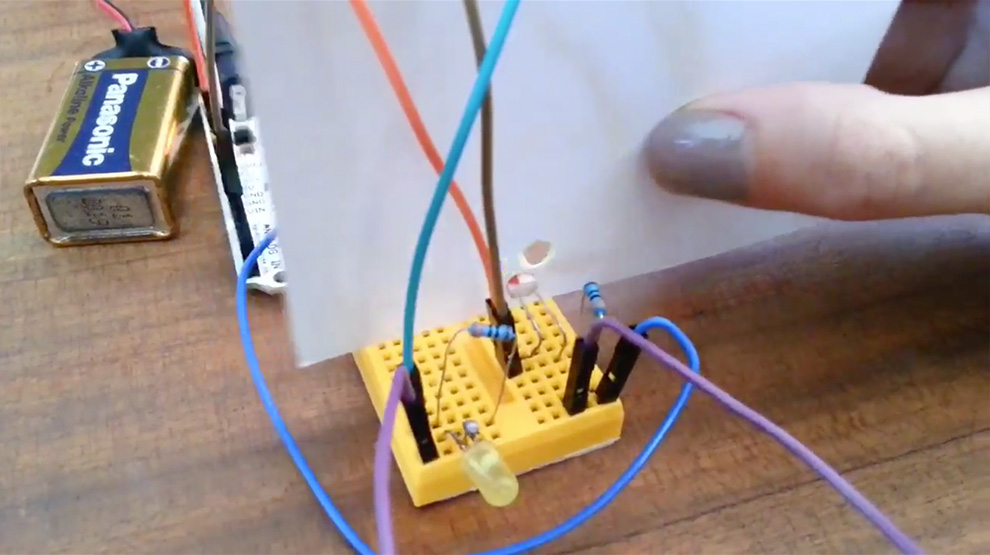
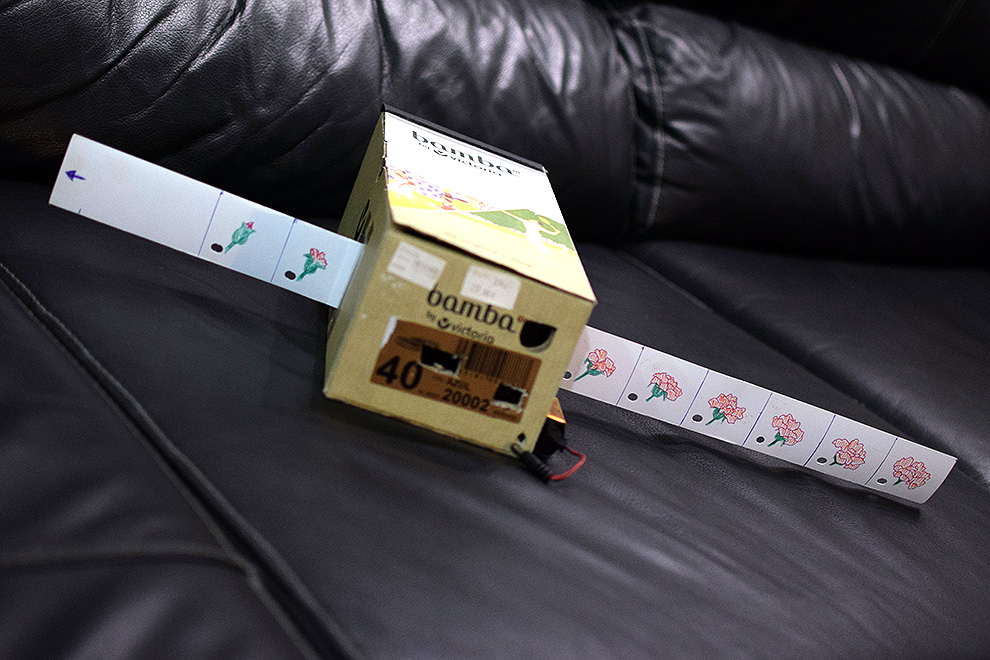
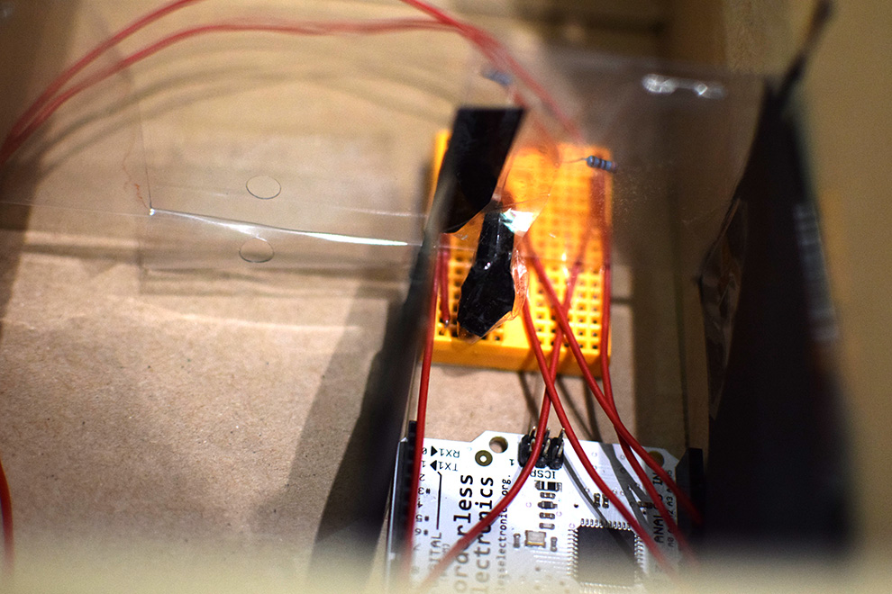
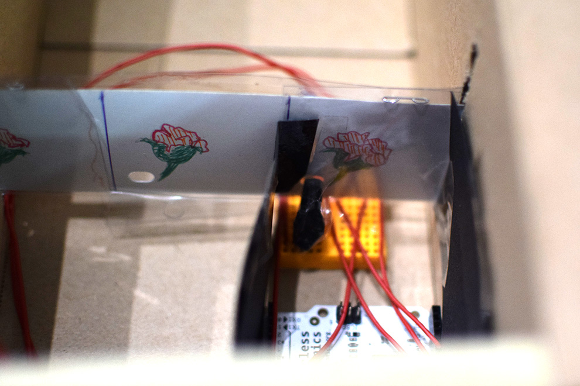
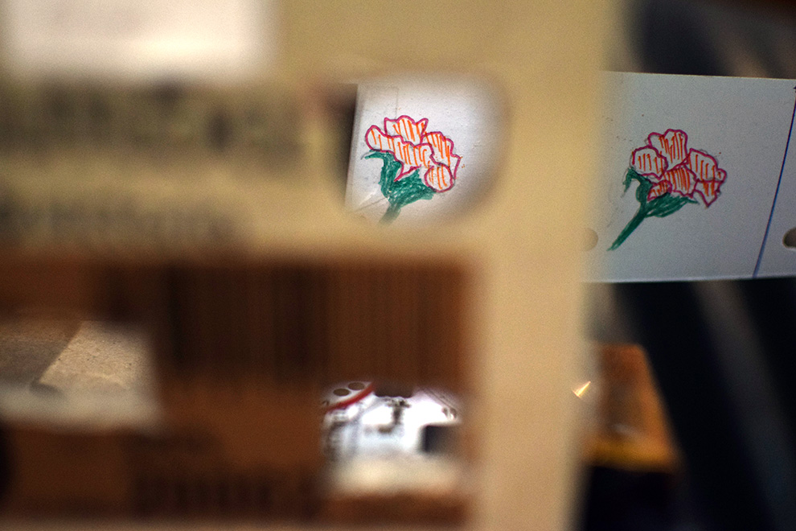
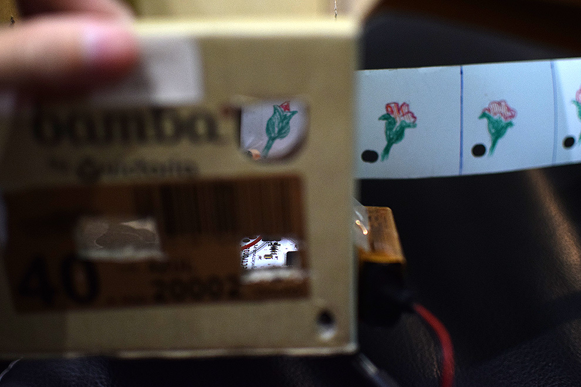

# Movie Box

## Uniendo tecnología y animación

(!cris)

Este proyecto está centrado en unir la pasión que sienten niños y adolescentes por el uso de las tecnologías y por los dibujos animados.

La idea es desarrollar actividades pedagógicas que sean atractivas, en las que se combinen ambas pasiones y en las que se descubran los orígenes de la animación. Movie Box, combina destrezas básicas como las de reutilización, actividades DIY, creatividad, fomentar la curiosidad, el juego, concentración, principios físicos de la óptica, conceptos históricos, trabajo en grupo y conexión con los mayores. 

(full)

Consiste en realizar una caja donde introduciremos una placa de Arduino, en ella aplicaremos principios básicos de programación para lograr que un sensor de luz capte el paso de nuestra película cinematográfica, la cual habremos hecho en cartulina poniendo en práctica nuestras habilidades artísticas y creativas. 

## Vistas del prototipo de circuito funcionando

Aquí estamos probando la primera fase del proyecto. Hemos diseñado el circuito con un Arduino Leonardo, un par de leds (uno de iluminación y otro de control), una resistencia fotovoltaica y unas cuantas resistencias de 110 ohm.

El funcionamiento es muy simple. Cuando la resistencia fotovoltaica capta la luz proveniente de uno de los led (el de control), enciende el led de iluminación. 

<blockquote class="twitter-video" data-lang="es">&mdash; Iván Gonzalo Moyano (@IvanGMoyano) <a href="https://twitter.com/IvanGMoyano/status/782185559439581184">1 de octubre de 2016</a></blockquote>

Cuando la tira de fotogramas se mueve hacia la izquierda, el orificio por donde pasa la luz del led de control se tapa y apaga la luz que ilumina el fotograma. De esta forma, al hacer pasar la tira rápidamente la luz de iluminación genera un efecto estroboscópico que sólo deja ver el fotograma centrado y alineado, del mismo modo que se proyectan las películas de cine.  

## Dibujando la tira de animación

La idea inicial fue hacer una animación con un muñeco de palos. Pero en ese momento estaba la madre de Gonzalo y se ofreció a hacer algo más pintoresco: el crecimiento de una flor.

 

## Prueba y reajuste del prototipo

Si bien, no es perfecto, se puede apreciar un poco la animación de la flor. ¿qué problemas hemos descubierto? Este vídeo fue hecho con la cámara de un móvil, el cual no responde bien a la oscuridad. Por otra parte se puede observar la imagen en movimiento. Esto podría solucionarse haciendo más pequeño el agujero. Pero de momento para un primer prototipo está bastante bien. 

<blockquote class="twitter-video" data-lang="es">&mdash; Cristina Góngora (@CrisGongoraGar) <a href="https://twitter.com/CrisGongoraGar/status/785968559356649472">11 de octubre de 2016</a></blockquote>

## Prototipo #1. Primer paso hecho: funciona!

